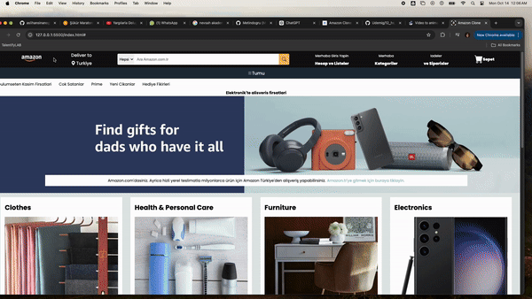

# amazonClone
# Amazon clone

This is a simple clone of the Amazon website created using HTML and CSS. The project showcases my ability to replicate a well-known interface while focusing on responsive design and clean coding practices.

# Features

- Responsive layout
- Navigation bar with links
- Product display section
- Footer with links
- Clean and modern design

# Technologies Used

- HTML
- CSS

# Overview

This is a simple clone of the Amazon website, built using HTML and CSS. The project demonstrates basic web design principles and aims to replicate the user interface of Amazon's homepage, providing a great starting point for understanding web development.

#Screen recording

A preview of my Amazon Clone project is included in the gif below

Kind regards.